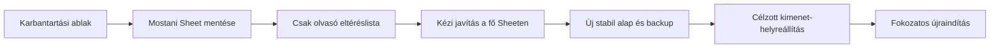

# Biztonságos helyreállítás a mostani fő Sheetből

**Döntés:** a jelenlegi éles `Tagnyil2627` fő Sheet a kanonikus állapot. Nem írunk
vissza régi staginget vagy régi teljes mentést. A külső források és a korábbi
backupok csak hiányok és eltérések kimutatására használhatók; a szükséges
adatjavításokat Zsolt vagy az arra kijelölt kezelő kézzel végzi el a fő Sheeten.

Ez a terv a [korábbi incidens-helyreállítási terv](registration-email-recovery.md)
régi, teljes Sheet-visszaállításra épülő lépéseit váltja fel.

## Mit mutat a mostani, csak olvasó ellenőrzés?

A 2026-09-01 18:22 CEST-kor lefutott audit szerint:

- a fő Sheetben 290 egyedi rekord van, duplikált ID nélkül;
- az `E-mail kimenet` 288 sort tartalmaz, duplikált küldési kulcs és duplikált
  küldési szándék nélkül;
- az `E-mail eseménynaplóban` 255 esemény volt;
- két fő-Sheet rekordhoz nincs e-mail-kimeneti sor: `1923` és `1936`; az
  automatizálási mezőik üresek, ezért ezek kézi felülvizsgálati jelöltek, nem
  automatikusan pótlandó hibák;
- egy történeti címzetteltérés maradt az `1800` ID-nál, az `E-mail kimenet` 32.
  sorában; a történeti kimenetet emiatt nem írjuk át;
- az `1955` ID névsegédmezője továbbra is kézi ellenőrzési jelölt;
- az audit alatt az aktív jóváhagyások és az eseménynapló változtak. Ez azt
  bizonyítja, hogy a rendszer jelenleg élő használatban van, tehát stabil
  helyreállítási alapot csak rövid karbantartási ablakban lehet rögzíteni.

Ezek közül egyik sem indokol teljes Sheet-visszaállítást.

## A biztonságos helyreállítás 6 pontja

### 1. Rövid karbantartási ablak és küldési zár

- Egyeztetett időpontban megállítjuk az új Gravity Forms-importot, a munkatársi
  szinkront, a befizetés-importot, a piszkozatfrissítést és az e-mail-küldést.
- A már elindított küldési kör vagy bizonyíthatóan befejeződik, vagy leáll; a
  kezdő pillanatban nulla aktív e-mail-jóváhagyásnak kell maradnia.
- A késve beérkező Brevo-webhookokat nem töröljük: az eseménynapló továbbra is
  append-only bizonyíték marad.
- Ettől a ponttól a jelenlegi fő Sheet az egyetlen helyreállítási alap. Régi
  staging, backup vagy CSV nem írhatja felül.

**Kilépési feltétel:** nincs aktív jóváhagyás és nincs olyan író folyamat, amely
a fő Sheetet vagy az e-mail-kimenetet megváltoztathatja.

### 2. A jó állapot rögzítése, nem visszaírása

- Teljes Drive-másolat készül a mostani éles Sheetről.
- A fő Sheetet és az `E-mail kimenet` lapot kétszer, egymást követően csak
  olvassuk; a két olvasásnak azonos tartalmi lenyomatot kell adnia.
- Rögzítjük a backup azonosítóját, az időpontot, a sor- és ID-darabszámokat,
  valamint a személyes adatot nem tartalmazó hasheket.
- Az eseménynaplónál elfogadható a késői Brevo-események hozzáfűzése, de meglévő
  sor nem változhat és nem tűnhet el.

**Kilépési feltétel:** létezik visszaolvasott, a productionnel egyező mentés és
két stabil fő-Sheet/e-mail-kimenet audit.

### 3. Eltéréslista és kézi javítás kizárólag a fő Sheeten

- A teljes Gravity Forms-exportot, a mentéseket és a jelenlegi e-mail-történetet
  csak összehasonlítjuk a fő Sheet ID-halmazával.
- A kimenet három rövid lista: valóban hiányzó ID, kötelező mezőhiány és
  felülvizsgálandó eltérés. Az összehasonlítás nem ír a Sheetbe.
- Zsolt vagy a kijelölt kezelő a jóváhagyott tételeket egyenként javítja a fő
  Sheeten. Nincs teljes sorcsere, tömeges visszatöltés vagy név alapján történő
  sorpárosítás.
- Első kézi jelöltek: `1923`, `1936` és `1955`. Az `1800` történeti
  e-mail-kimenetét nem javítjuk visszamenőleg; csak azt döntjük el, kell-e új,
  külön jóváhagyott kommunikáció.
- Minden kis javítási kör után újra lefut a csak olvasó audit. Régi rekord,
  pénzügyi dátum vagy megjegyzés nem veszhet el.

**Kilépési feltétel:** minden jelöltnek van emberi döntése: javítva, szándékosan
üres, vagy dokumentáltan történeti eltérés.

### 4. A kijavított fő Sheet új alapállapottá fagyasztása

- A kézi javítások után ismét két változatlan olvasás és új teljes Drive-mentés
  készül.
- Kötelező ellenőrzés: nulla duplikált vagy üres ID, minden nem üres ID-s sorban
  megvan a növendék neve, a szükséges fejlécek változatlanok, és a kézi pénzügyi
  vagy megjegyzésmezők kitöltöttsége nem csökkent.
- Az e-mail oldalon nulla aktív jóváhagyás, nulla duplikált küldési kulcs, nulla
  duplikált küldési szándék és nulla magyarázat nélküli master-kapcsolati hiba
  maradhat.

**Kilépési feltétel:** az új backup és a kijavított production hash szerint
egyezik; ez lesz a további működés visszaállási pontja.

### 5. Csak a szükséges származtatott adatok újraépítése

- Az `E-mail kimenet` nem kap teljes újragenerálást. Először írásmentes előnézet
  készül kizárólag a kézzel javított vagy jóváhagyottan pótolt ID-kra.
- Meglévő küldési kulcs, Brevo message ID, kézbesítési esemény és manuális
  küldési bizonyíték változatlan marad.
- A `1923` és `1936` csak akkor kap piszkozatot, ha a kézi elbírálás szerint
  valóban szükséges. Az új piszkozat jóváhagyása minden esetben `false`.
- A végrehajtás csak változatlan production snapshot, tervhash és friss egyező
  backup mellett írhat; régi fő-Sheet sort nem módosíthat és semmit nem törölhet.

**Kilépési feltétel:** pontosan a jóváhagyott ID-khoz jött létre a várt új
kimenet, régi sor és küldési bizonyíték változatlan.

### 6. Fokozatos újraindítás, minden lépés után megállási ponttal

Az írási utak ebben a sorrendben térhetnek vissza:

1. csak olvasó import- és szinkronelőnézet;
2. append-only import, először egyetlen ellenőrzött új ID-val;
3. piszkozatkészítés csak ehhez az ID-hoz, automatikus jóváhagyás nélkül;
4. egyetlen kézzel jóváhagyott küldés és a Brevo request/delivery ellenőrzése;
5. a normál jelentkezés–e-mail folyamat kis tételekben;
6. a munkatársi szinkron és a befizetés-import csak külön előnézet, backup és
   külön jóváhagyás után.

A munkatársi szinkron az oszlopokat fejléc alapján párosítja, nem betűjel vagy
pozíció alapján. Az `I. féléves tandíjfizetés dátuma` a fő Sheetben a fejléc
alapján kerül kiválasztásra, és a munkatársi Sheet I oszlopába csak akkor ír,
ha az adott munkatársi cella üres és a fő-Sheet érték nem üres. Már kitöltött
munkatársi dátumot nem cserél le és üres fő-Sheet értékkel sem töröl.
Meglévő ID-s sorban ezen kívül semmilyen cellát nem módosít: az `Egyéb
megjegyzés`, a második féléves tandíjfizetés dátuma, az alapadatok és minden
más munkatársi mező változatlan marad. Az azonosító alapadatokat csak a lista
végén létrehozott új sorok kapják meg.

A 2026-09-03-i csak olvasó összevetés ezt a szabályt 155 munkatársi ID-s
soron ellenőrizte. A jelenlegi adatokon 35 üres munkatársi I-cellát töltene ki,
15 meglévő értéket őrizne meg üres fő-Sheet cellával szemben, további 10
meglévő értéket pedig eltérő fő-Sheet dátummal szemben. Az `1772` ID csak
a munkatársi lapon szerepel; ezt az előnézetnek külön eltérésként kell
jeleznie és érintetlenül kell hagynia. A munkatársi szinkron nem töröl sort;
az eltérés rendezése külön kézi döntés.

Minden fokozat után új audit készül. Azonnali leállás következik, ha megváltozik
egy régi fő-Sheet sor, eltűnik kézi adat, duplikált ID vagy küldési szándék
jelenik meg, aktív jóváhagyás marad emberi döntés nélkül, vagy a tervhash/backup
nem egyezik.

**Kész állapot:** a mostani, kézzel rendbe tett fő Sheet a dokumentált alap; a
normál folyamat egy új rekorddal végigpróbált; nincs magyarázat nélküli eltérés;
és minden írási út rendelkezik előnézettel, friss backuppal és egyértelmű
leállási szabállyal.

## Mi nincs benne ebben a helyreállításban?

- régi staging vagy teljes backup visszaírása productionre;
- meglévő fő-Sheet sorok automatikus frissítése külső exportból;
- történeti e-mail-kimenet átírása;
- automatikus e-mail-jóváhagyás vagy tömeges kontrollküldés;
- D1-re vagy más új architektúrára való átállás.

## Élesítési állapot — 2026-09-03

- A szűkített Worker production-verziója:
  `887ec8ad-3db3-4509-a3f2-e65cc50fe96b`.
- A közvetlen visszaállási pont:
  `05f1e5c0-24dc-4469-ad1b-6067fd3ad0d7`.
- A Zsolt által kijelölt 12:43-as teljes rollback-backup:
  `1bF9mGpZXBV9QyE5UAg0sVgIKg-spap7j93cOJX7yXvY`; a közvetlen írás előtti
  `TAGOK 2026-27!A1:AF876` cellatartalma pontosan egyezett a production lappal.
- A 192 soros első tervet a biztonsági kapu írás nélkül leállította, mert
  közben hat új fő-Sheet rekord érkezett. Zsolt a 198 új soros friss tervet
  külön jóváhagyta.
- Az éles szinkron 198 új sort írt a `TAGOK 2026-27!A157:I354` tartományba,
  és 35 meglévő sor korábban üres I-celláját töltötte ki.
- Az utóellenőrzés 353 egyedi munkatársi ID-t talált, mind a 352 fő-Sheet ID
  jelen van, az `1772` megmaradt, és az engedélyezett cellákon kívül nulla
  változás történt.
- A szinkron utáni, productionnel visszaolvasva pontosan egyező backup:
  `1b5N8jB5lZRlII4d75k60GNca-hjXpXDRqQgpMYbrH24`.

**Következő lépés:** a `Budai Tánc → Munkatársi Sheet-szinkron`
menüpontok visszahelyezése a fő Sheethez kötött Apps Scriptbe. A kiadandó
forrás elkészült, de a bound projektazonosító és csatlakoztatott böngésző
hiányában a Google-oldali publikálás még nem történt meg.
