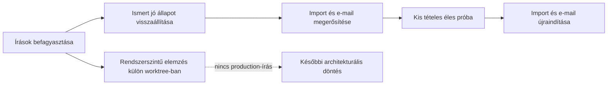

# A jelentkezés–e-mail képesség biztonságos visszaállítása

**Állapot:** végrehajtás folyamatban — production visszaállítva 2026-08-27  
**Dátum:** 2026-08-26

## Döntés

Először egy szűk, ellenőrizhető szolgáltatást állítunk vissza:

1. teljes Gravity Forms-export vagy csak friss jelentkezéseket tartalmazó, azonos fejlécű CSV importálása;
2. kizárólag új azonosítók hozzáadása;
3. e-mail-piszkozatok elkészítése;
4. kézi ellenőrzés és jóváhagyás utáni küldés.

A befizetések érkeztetését kikapcsoljuk. Nem töröljük most a kódját vagy a pénzügyi adatokat; egyszerűen elérhetetlenné tesszük az éles rendszerben, hogy ne növelje a helyreállítás kockázatát. A teljes munkatársi szinkront is szüneteltetjük, mert törlésre is képes, és nem szükséges az elsődleges célhoz.

Ezzel párhuzamosan külön, production-írás nélküli szálon elkészül a rendszerszintű javítási javaslat. Ez a szál nem módosíthatja az éles helyreállítást vagy annak kódját.

## 2026-08-27-i végrehajtási állapot

- A production a hitelesített staging-forrásból sikeresen helyreállt. Az ellenőrzés 169 egyedi fő Sheet ID-t, 169 egyedi e-mail-kulcsot és nulla bekapcsolt jóváhagyást adott. A 19:23:56 utáni nyolc igazolt manuális/Brevo-küldési bizonyíték megmaradt; új levél nem ment ki. A részletek a [production visszaállítási jelentésben](../../reports/incident-restore-production-2026-08-27-success.json) vannak.
- A kézi, kétlépcsős CSV-import élesben nyitva van. A már létező ID-k mindig kihagyott tételek; a CSV-ből hiányzó régi ID-k érintetlenek maradnak. Csak az új ID kerülhet a főlap végére.
- Az import sikeroldalán 15 percig érvényes, konkrét új ID-khoz kötött piszkozatlépés jelenik meg. Piszkozat készülhet, de jóváhagyás és Brevo-küldés nem indulhat automatikusan.
- A Gravity Forms webhook, befizetés-import és teljes munkatársi szinkron továbbra is letiltva marad. Az Apps Script forrása elkészült, de a bound projekt azonosítója hiányzik, ezért a friss menü még nincs productionbe telepítve.
- Hátralévő éles kapu: egyetlen új rekord kontrollált importja, az abból készült piszkozat celláról cellára való ellenőrzése, majd külön emberi jóváhagyással egyetlen küldés és Brevo-visszaigazolás.

## A visszaállítás alapja

Az ismert jó állapot a 2026-08-26 19:23:56-kor sikeresen ellenőrzött production-migráció kimenete. Ennek változatlan, elkülönített próbapéldánya a [helyreállítási próba jelentésében](../../reports/incident-recovery-staging-final-live-2026-08-26.json) szereplő staging Sheet.

Az elfogadott alapállapot bizonyítékai:

- 169 egyedi jelentkezési azonosító;
- a főlap tartalmi lenyomata: `16a1a62d5a9354cd2b330ffd2c0d9d00d2927326b49afb01728c8b1454909ac9`;
- az `E-mail kimenet` tartalmi lenyomata: `04567732dace7eb8b2b755fed51c0e159496ef8329160dc9ed68ab07e0736b4e`;
- 169 egyedi küldési kulcs;
- nulla bekapcsolt e-mail-jóváhagyás;
- a production visszaírása ugyanezeket a lenyomatokat adta a [migrációs jelentésben](../../reports/incident-production-migration-2026-08-26.json).

A jelenlegi `scratch/incident-recovery-2026-08-26/` CSV-fájlokat nem használjuk vakon visszaállítási forrásként: több jelenlegi fájl hash-e már nem egyezik a production-migrációhoz jóváhagyott manifesttel. A staging Sheetet is csak kétszeri visszaolvasás és a fenti lenyomatok egyezése után szabad használni.

## A szál — az alapműködés visszaállítása

### 0. Elkülönítés és befagyasztás

- A helyreállítás saját worktree-ban és ágon készül. A rendszerszintű szál másik worktree-t kap.
- Előbb leltározzuk a más munkamenetekből származó, jelenleg commitolatlan [Worker-változásokat](../../cloudflare-worker/src/worker.js) és [tesztváltozásokat](../../cloudflare-worker/test-smoke.mjs). Ezeket nem írjuk felül, hanem egyértelmű átadás vagy commit után visszük tovább.
- Ideiglenes karbantartási kapcsoló letilt minden production-írást: webhook, CSV-import, teljes munkatársi szinkron, befizetés-import, piszkozatfrissítés és küldés.
- A Gravity Forms marad az új jelentkezések forrása. A karbantartás alatt beérkező jelentkezések onnan később újra importálhatók, tehát nem kell a sérült Sheetet tovább írni.
- A jelenlegi, sérült production Sheetről teljes Drive-másolat és csak azonosítókat, sorszámokat, darabszámokat és hasheket tartalmazó auditjelentés készül. Ez lesz a visszaállási pont és az incidens bizonyítéka.
- Ellenőrizzük, hogy 19:23:56 után történt-e valódi Brevo-küldés. Ha igen, annak megváltoztathatatlan küldési bizonyítékát a visszaállítás előtt át kell vezetni, különben duplán küldhetünk.

**Kilépési feltétel:** két egymás utáni production-olvasás azonos hasht ad, egyetlen író végpont sem aktív, és létezik ellenőrzött Drive-backup.

### 1. A visszaállítás próbája

- Külön helyreállító parancs készül, amely az ismert jó staging Sheetet olvassa, nem a jelenlegi production tartalmából próbálja újra kitalálni a helyes sorokat.
- A parancs kétszer olvassa vissza a staging forrást, és csak a rögzített hashek egyezésekor folytatja.
- Először a sérült production Drive-másolatán fut le. Kezelnie kell a már létező incidens-segédlapokat és a hibás `B:AI` alapszűrőt is.
- A próba végén minden visszaírt lapot visszaolvas és hash szerint ellenőriz. Ezután ugyanazon a másolaton a rollbacket is elpróbálja.
- A parancs semmilyen e-mailt nem küldhet, és nem hívhatja meg a Workert.

**Kilépési feltétel:** az elkülönített próbán a visszaállítás és a rollback is pontos hash-egyezéssel zárul.

### 2. Production visszaállítás

- A production újbóli kétszeri, változatlan olvasása után lefut a jóváhagyott helyreállítás.
- A főlap, az `E-mail kimenet` és az incidenshez tartozó segédlapok az ismert jó állapotot kapják vissza. A napló- és beállításlapokat csak akkor írjuk, ha a preflight szerint eltérnek, és az eltérés nem új, megőrzendő esemény.
- A hibás `B:AI` alapszűrő megszűnik. Helyette vagy nincs fizikai rendezést végző szűrő, vagy a teljes, fejlécből felismert táblaszélességet lefedő filter view készül.
- A visszaírás után azonnal ellenőrizzük a 169 egyedi ID-t, a master- és e-mail-hasheket, a 169 egyedi küldési kulcsot és a nulla aktív jóváhagyást.
- Eltérésnél automatikus rollback történik az imént készített Drive-backupból. A karbantartási kapcsoló rollback után is bekapcsolva marad.

**Kilépési feltétel:** a production ismét pontosan az ismert jó, 169 rekordos állapotot tartalmazza, de továbbra sem fogad írást.

### 3. A minimális importútvonal megerősítése

A jelenlegi import helyett kétlépcsős, tervhez kötött import készül.

#### Előnézet

- Ellenőrzi a teljes Gravity Forms fejlécet, az üres és duplikált ID-kat, valamint a production fejlécét és ID-egyediségét.
- Megtagadja a műveletet, ha a Sheet alapszűrője nem a teljes táblát fedi le, ha az input CSV-ben üres/duplikált ID van, vagy ha a productionben az ID-k és a kötelező fejléc nem egyediek illetve érvényesek. A már létező ID nem hibás bemenet: az import következetesen kihagyja, mert azt nem módosíthatja.
- Pontosan felsorolja az importálandó új ID-kat, a kihagyott meglévő ID-kat, valamint az e-mail-történetben már szereplő, de a masterből hiányzó helyreállítási rekordokat.
- Egy hashelt importtervet ad vissza. Az éles végrehajtás csak ugyanazon CSV, változatlan production snapshot és ugyanazon tervhash mellett indulhat el.

#### Végrehajtás

- Az import ID-alapú és append-only: meglévő ID-t nem frissít, nem töröl, és nem használja fel az első üresnek látszó névcellát.
- Megszűnik az a tartalékszabály, amely név+dátum alapján vagy egy üres növendéknév alapján választ sort. Új ID csak az utolsó teljes rekord után kaphat új sort.
- Az írás előtt külön Drive-backup készül.
- Visszaolvasás után igazolni kell, hogy minden régi rekord tartalmi hash-e változatlan, és pontosan a tervezett új rekordok jelentek meg.
- Az import nem küld e-mailt. A master írása és az e-mail-piszkozatok előállítása két külön, ellenőrizhető fázis.

### 4. Az e-mail útvonal megerősítése

- Piszkozat csak a most importált ID-kra készül; a teljes régi állományt nem számoljuk újra egy import mellékhatásaként.
- Küldési szándékonként pontosan egy küldési kulcs lehet. A korábbi Brevo- vagy manuális küldési bizonyíték elsőbbséget élvez, és nem írható felül.
- Az új piszkozatok jóváhagyása mindig `false`; import vagy piszkozatfrissítés nem kapcsolhatja be.
- Küldeni továbbra is csak kézi jóváhagyás, változatlan revíziós hash és érvényes címzett mellett lehet.
- Az e-mail-történetben már szereplő, de a visszaállított masterből hiányzó ID-k importálhatók, de a meglévő küldési bizonyítékuk miatt nem kaphatnak második levelet.

### 5. A nem szükséges írási utak kikapcsolása

- A `/payments/` végpont explicit `disabled` választ ad még helyes tokennel is.
- Az Apps Script menüből eltűnik a befizetés-import és annak tokenbeállítása.
- A pénzügyi kódot és lapokat ebben a helyreállításban nem töröljük; ez külön, későbbi döntés.
- A teljes munkatársi szinkron végpont és menüpont kikapcsolva marad. Az új jelentkezések munkatársi táblába írása sem része az első éles próbának.
- Az automatikus Gravity Forms webhook csak azután térhet vissza, hogy ugyanazokat az integritási ellenőrzéseket használja, mint a kézi import. Az első újraindítás kézi CSV-importtal történik.

### 6. Táblázatos védőkorlátok

- Az azonosító- és forrásoszlopok védettek; csak a fejléc neve alapján engedélyezett kézi mezők szerkeszthetők.
- A napi szűréshez teljes szélességű filter view készül. A kanonikus lapon nem maradhat részleges alapszűrő.
- Minden import, piszkozatfrissítés és küldés előtt lefut az ID-egyediség, fejléc, filtertartomány és soridentitás ellenőrzése. Eltérésnél a rendszer nem próbál javítani, hanem leáll és egy ember számára érthető hibát ad.
- A védelem nem csak a Google Sheets felületére hagyatkozik: a tulajdonos a védelmet is meg tudja kerülni, ezért a Worker oldali integritási kapu a végső biztosíték.

### 7. Tesztelés és kis tételes újraindítás

Kötelező automatizált esetek:

- részleges `B:AI` filter vagy rendezési állapot elutasítása;
- duplikált, hiányzó vagy már létező ID kezelése;
- olyan sor elutasítása, ahol van ID, de üres a növendéknév;
- annak bizonyítása, hogy egy új import egyetlen régi sort sem módosít;
- e-mail-történetben szereplő, masterből hiányzó ID biztonságos helyreállítása;
- nulla automatikus jóváhagyás és nulla Brevo-küldés az import/piszkozat fázisban;
- ismételt import és ismételt piszkozatfrissítés mellékhatás-mentessége.

Éles újraindítás:

1. Friss, teljes Gravity Forms-export vagy csak új jelentkezőket tartalmazó, azonos fejlécű CSV készül.
2. A dry run megmutatja a 169-es alaphoz képest új ID-k pontos listáját; meglévő rekord frissítése vagy törlése nem lehet a tervben.
3. Először egyetlen ellenőrzött rekordot importálunk.
4. A master sorát és az elkészült e-mail-piszkozatot a Gravity Forms forrással celláról cellára összevetjük.
5. Egyetlen levél kézi jóváhagyással kerül kiküldésre, majd megvárjuk és ellenőrizzük a Brevo eseménynaplóját.
6. Csak ezután importáljuk a fennmaradó új rekordokat. A levelek továbbra is egyenként vagy kis, emberileg átnézett csoportokban hagyhatók jóvá.

## B szál — rendszerszintű javítási javaslat

Ez a szál az A szállal párhuzamosan futhat, de csak kódolvasást, incidenselemzést és dokumentumírást végezhet. Nem deployolhat, nem írhat Google Sheetet, és nem módosíthatja az A szál fájljait.

A vizsgálat témái:

- mi legyen a kanonikus adatforrás, és hogyan váljon szét az ember által rendezhető nézet a gép által írt adatoktól;
- append-only eseménynapló és rekonstruálható aktuális állapot;
- adatbázis vagy más stabil tároló szerepe a Sheet helyett/mellett;
- import-, e-mail- és későbbi pénzügyi folyamatok külön szolgáltatási határai;
- idempotencia, sémaverzió, auditnapló, megfigyelhetőség, mentés és rendszeres visszaállítási próba;
- fejlesztési folyamat: külön worktree-k, tesztkörnyezet, release gate és production-változtatási napló.

A kimenet egy döntési dokumentum lesz 2–3 reális architekturális lehetőséggel, költséggel, kockázattal és javasolt átállási sorrenddel. A nagyobb átalakítás csak az A szál stabil lezárása után indulhat el.

## Automatikus leállási szabályok

A végrehajtás azonnal megáll, ha:

- a staging Sheet hash-e nem egyezik a rögzített ismert jó állapottal;
- a production a két preflight-olvasás között megváltozik;
- 19:23:56 utáni küldési esemény marad tisztázatlan;
- a dry run meglévő rekord módosítását vagy törlését tervezi;
- az import után bármely régi rekord hash-e megváltozik;
- duplikált ID, duplikált küldési kulcs vagy automatikusan bekapcsolt jóváhagyás jelenik meg.

Az eltérés nem „még egy gyors javítást” indít el, hanem visszaállítást és új preflightot. Most kifejezetten az a cél, hogy a rendszer inkább udvariasan megálljon, mint lelkesen romboljon.

## Késznek tekintjük, ha

- a production ismert jó alapról indult;
- a befizetés-import és a teljes munkatársi szinkron nem hívható meg;
- ugyanaz a teljes CSV kétszer importálva másodszorra nulla írást okoz;
- kizárólag új ID-k kerülnek a főlap végére, a régi sorok változatlanok;
- az új rekordokhoz pontos és egyedi e-mail-piszkozat készül;
- sem import, sem piszkozatfrissítés nem küld levelet és nem ad jóváhagyást;
- egy ellenőrzött éles levél a kézi jóváhagyás után egyszer kerül kiküldésre, és a Brevo-visszajelzés bekerül a naplóba;
- a backup, rollback és az incidensjelentés megmarad;
- a rendszerszintű szál külön döntési anyagot ad, de nem veszélyeztette az éles helyreállítást.

## Még ellenőrzendő három pont

1. **A staging Sheet azóta változatlan-e?** A legkisebb teszt a kétszeri visszaolvasás és a rögzített hashek ellenőrzése. Eltérésnél nem használjuk forrásként.
2. **Történt-e valódi küldés a jó alapállapot után?** A legkisebb teszt a Brevo- és eseménynapló időalapú egyeztetése. Ha igen, előbb megőrizzük a küldési bizonyítékot.
3. **A Gravity Forms export tartalmaz-e minden, az alapállapot utáni jelentkezést?** A legkisebb teszt az ID-halmaz és a bejegyzési idők ellenőrzése. Hiánynál nem indítjuk újra az importot.
